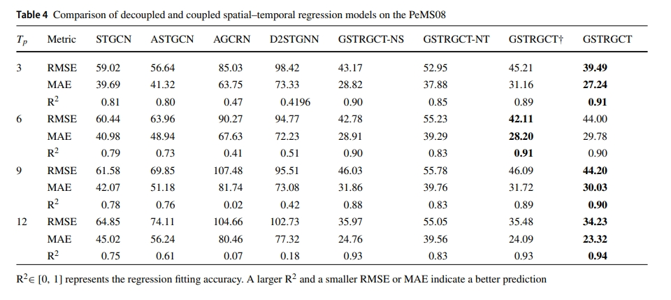

# Generalized spatial–temporal regression graph convolutional transformer for traffic forecasting

This repo contains the source code for GSTRGCT and the experiment data including PeMS04 and PeMS08.

**Generalized spatial–temporal regression graph convolutional transformer for traffic forecasting.**

*Lang Xiong, Liyun Su, Shiyi Zeng, Xiangjing Li, Tong Wang, Feng Zhao*

* Paper: [https://link.springer.com/content/pdf/10.1007/s40747-024-01578-x.pdf](https://link.springer.com/content/pdf/10.1007/s40747-024-01578-x.pdf)

We propose a novel unified spatial–temporal regression framework named Generalized Spatial–Temporal Regression Graph Convolutional Transformer (GSTRGCT) that extends panel model in spatial econometrics and combines it with deep neural networks to effectively model non-stationary relationships of spatial–temporal regression. GSTRGCT is a quite simple-minded spatial–temporal regression framework and has the theoretical underpinnings of panel models. GSTRGCT outperforms other competitive methods including traditional spatial-temporal regression models and deep spatial-temporal regression networks with an average of 62% and 59% on predictive performance.

**1. Framework of GSTRGCT**

GSTRGCT decouples the spatial–temporal regression into spatial regression on the spatial hyper-plane and temporal regression on the temporal hyper-plane based on the tensor decomposition, which employs improved GCN and Transformer Encoder to learn representations dynamically at different scales. The spatial and temporal representations are aggregated by the tensor product to obtain the spatial–temporal representation.


2. Decoupled vs. Coupled spatial–temporal regression

spatial–temporal decoupling can retain the spatial–temporal information of the original data, while spatial–temporal coupling is prone to cause information misalignment due to modal mixing.


# Main Result

We experiment on 2 benchmarks for traffic flow forecasting. We compare our model with fourteen baselines, including traditional spatial-temporal regression models , such as ME, FE, and RE, and deep spatial-temporal regression networks, such as STGCN, ASTGCN, D2STGNN, etc,  GSTRGCT achieves SOTA, with an average of 62% and 59% over previous baselines on predictive performance.


To validate the effectiveness of the decoupling method, we compare the prediction performance for 3, 6, 9, and 12 future time steps with the same history time steps 12. GSTRGCT outperforms the coupled method including STGCN, ASTCN, and AGCRN, and outperforms the decoupled method such as D2STGNN. Moreover, GSTRGCT significantly outperforms GSTRGCT†, GSTRGCT-NS, GSTRGCT-NT,and baselines, which shows that spatial–temporal decomposition, DASWNN, and Auto-Correlation are crucial.



# Get Started

1. Install Python 3.7, Pytorch 1.11.0, and Cuda 11.5
2. We provide the real-world traffic data including PeMS04 and PeMS08 in "*./data*" directory.

You can use the following commands to train/test in your python environment.

```python
git clone https://github.com/CQULangXiong/GSTRGCT
cd GSTRGCT
python main.py
```

# Citation

If you find this repo useful, please cite our paper.

```html
@article{xiong2024generalized,
  title={Generalized spatial--temporal regression graph convolutional transformer for traffic forecasting},
  author={Xiong, Lang and Su, Liyun and Zeng, Shiyi and Li, Xiangjing and Wang, Tong and Zhao, Feng},
  journal={Complex \& Intelligent Systems},
  pages={1--22},
  year={2024},
  publisher={Springer}
}
```

# Contact

If you have any questions about the source code, please contact  xionglang@stu.cqut.edu.cn
